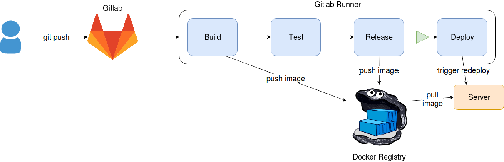
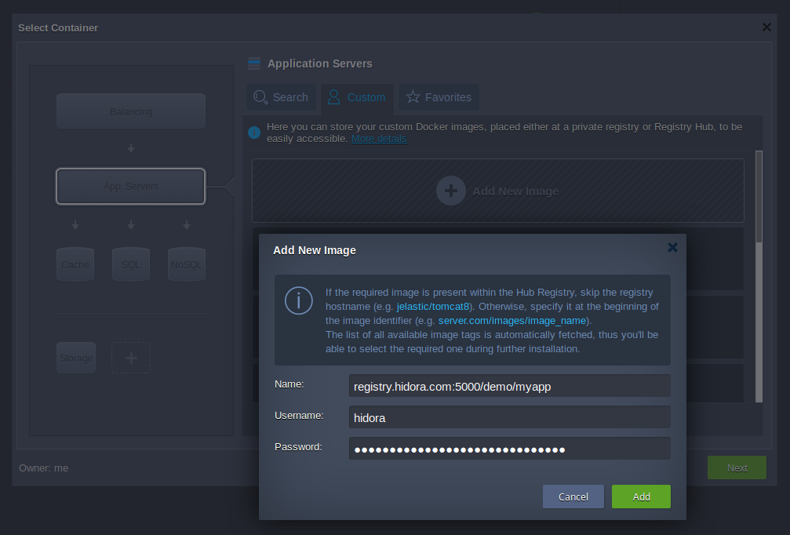

# Deployment with Docker Registry



This method is more advanced than [git+ssh method](/Automation/Gitlab/ssh+git). It uses Docker images and Docker Registry to test and deploy.
It is more adapted for complex environments thanks to its benefits, in particulary : 

- We rely more on the functionalities of Docker containers. By this way, sources and dependencies of your application will be always moved together.
- It is possible to test our application in a pipeline because we can create quickly a test environment.
- It is easy to debug a potential issue because we have the possibility to run locally an image from the Docker registry.

> From a developer point of view, it is still easy to launch an automatized pipeline via a simple git push.

## Requirements

- A Gitlab Server with a runner configured with *Docker* mode. More information on this [documentation](https://docs.gitlab.com/runner/install/docker.html).
- A Docker Registry Server (hosted on Hidora). You can use this script to deploy it in few seconds on our platform:
https://github.com/HidoraSwiss/manifest-registry

## Dockerfile

Firstly, it is necessary to add on your files sources a `Dockerfile` to build an image ready for Production for every push.

We add files sources of the Git repository directly in our image via Dockerfile.
For example, if you want to deploy a PHP application, your Dockerfile will look like this :

```dockerfile
FROM php:7.0-apache
COPY . /var/www/html/
```

Note that the usage of `COPY` will add all source files in the directory `/var/www/html` of the Apache Server. For applications more complex (donwload configs, assets compilation ...), you can provide actions in the Docker file. For more information, have a look on [Dockerfile documentation](https://docs.docker.com/engine/reference/builder/).

## Create the environment

Before to deploy automatically your modifications, you need to create an environmnent on Hidora.

For that, start to build an image with your source code locally in order to push it on your Docker Registry:
```bash
docker build -t <url-registry>:<port-registry>/dir/image_name .
docker push <url-registry>:<port-registry>/dir/image_name
```

Now, you have a first image which will allowed you to create an environment on Hidora.

Then, sign into Hidora's web interface and use the panel *New environment* to create an environment using your image in your Docker Registry.



## .gitlab-ci.yml

In a file `.gitlab-ci.yml` located in your source code, copy the content below:

```yaml
image: docker

variables:
  IMAGE_TEST: dir/image_name:$CI_COMMIT_REF_NAME
  IMAGE_RELEASE: dir/image_name:latest

stages:
  - build
  - test
  - release
  - deploy

before_script:
  # We need to be authenticate to our Docker Registry during each steps
  - docker login -u $REGISTRY_USER -p$REGISTRY_PASS $REGISTRY_URL

build:
  stage: build
  script:
        # We build the test image
    - docker build -t $REGISTRY_URL/$IMAGE_TEST .
    # We push this image into the Docker registry
    - docker push $REGISTRY_URL/$IMAGE_TEST

test:
  stage: test
  script:
        # We test the latest version of our image application test
        - echo "Test your application using the new image"
        # # Example:
    # - docker pull $REGISTRY_URL/$IMAGE_TEST
    # - docker $REGISTRY_URL/$IMAGE_TEST ./test-script.sh

release:
  stage: release
  only:
    - master
  script:
  # If the image passed the test, we update the image on the Registry
    - docker pull $REGISTRY_URL/$IMAGE_TEST
    - docker tag $REGISTRY_URL/$IMAGE_TEST $REGISTRY_URL/$IMAGE_RELEASE
    - docker push $REGISTRY_URL/$IMAGE_RELEASE

deploy:
  stage: deploy
  image: mwienk/jelastic-cli
  when: manual # The deployment need to be launch manually
  only:
    - master
  before_script:
        # We need to be identified to use Jelastic API on Hidora
    - /root/jelastic/users/authentication/signin --login $LOGIN --password $PASSWORD --platformUrl app.hidora.com
  script:
        # We launch the redeployment of our container on Hidora
    - /root/jelastic/environment/control/redeploycontainerbyid --envName $ENVNAME --nodeId $NODE_ID --tag latest --useExistingVolumes false
```

This configuration describes a generic pipeline that need to be adapted to your application. Think to modify : 

- The name of your image in variables `dir/image_name`
- Command line to launch during `test` step

Then, you need to provide to your pipeline different environment variables to be able to deploy corectly your application. From your repository Gitlab, go into *Settings > CI/CD > Secret variables* and add these variables: 

- **REGISTRY_URL**: Address of your Docker Registry. For example, `registry.hidora.com`

- **REGISTRY_USER** et **REGISTRY_PASS**: Credentials of your Docker Registry.
- **ENVNAME**: Environment name that you want to use to deploy your application. For example, `env-542623` (do not put the  *.hidora.com* part)
- **NODE_ID**: ID of the node on wich you want to deploy your app.
- **LOGIN** et **PASSWORD**: Credentials used to sign in on Hidora's platform.

> To manage accurately a deployment on Hidora, a documentation is available [here](/Automatisation/Script de déploiement).

## Let's Go !

When all steps are done, push your source code on Gitlab with your new files and check the tab *CI/CD > Pipelines* of your Gitlab repository to see logs.


If everything works well, you will see that each "job" of your pipeline shows a green icon. Depending the configuration of your Gitlab pipeline, the last job is on "manual" mode (it means that you need to launch it manually for the deployment). To complete the pipeline, click on the "play" symbol.

If a job has failed, click on it to see the reason.

## Data persistence

Depending your application, there is few configurations that can be implemented to avoid to loose data.

In the deployment method above, if files are added on the Deployment Server, it will be lost during the redeployment. It is because of the use of the option `--useExistingVolumes false` (last line of the pipeline) which will replace all files of the containers by the new image.

To have persistence data (files which have been uploaded or logs files for example), you need to configure your Dockerfile like below: 

- In your Dockerfile, directories that you do not want to be erase after each deployment need to be specify as a *volume* (example : `VOLUME /var/html/www/wp-content/uploads`). Be careful !  If directory that content your code source is declared as *volume*, updated files will not be take in charge during redeployment.

In the file `.gitlab-ci.yml`, replace `--useExistingVolumes false` by `--useExistingVolumes true`.

With this configuration, specific files of your Deployment Server will be kept while the source code of your application will be update.

This configuration can be difficult to set up. Do not hesitate to contact us on the [support](https://support.hidora.com/portal/newticket).

If you found errors or optimisations, please tell us on [GitHub](https://github.com/HidoraSwiss/documentation) !
