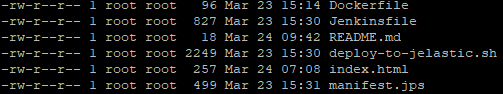
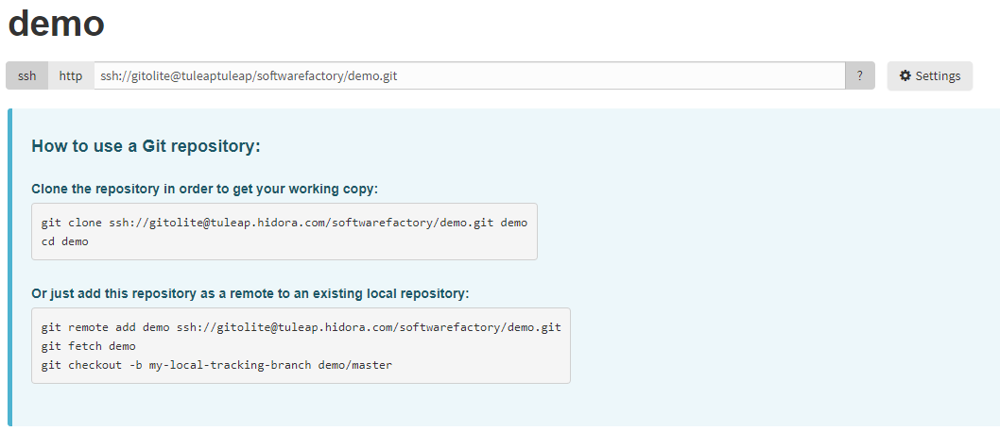

# Deploy automatically an image Docker from Tuleap and Jenkins


The method that we will set up works on the same principle than [Docker Registry with Gitlab](../Gitlab/DockerRegistry.md). It means that we will automated deploiment of an application on Hidora's platform.

## What is  Jenkins?
[Jenkins](https://jenkins.io/) is an open source tool which is doing *Continuous Integration*. It has written in *java* and can automate nonhuman tasks. Jenkins support version management tools like Subversion, Git, CVS ...

It can be possible to launch automated *builds* in multiple ways, like after a *commit* on a special version management repository or launch the *build* after the *build* of another project.
These *builds* can detect bugs during  development projects.

## What is Tuleap?
[Tuleap](https://www.tuleap.org/)  is a complete tool which allows to manage tickets, agile projects, automate development etc... Big companies like Ericsson, Atos, Renault or even Orange is using this tool to centralize their projects.
In our case, we will use the Git of Tuleap and also the plugin *Hudson/Jenkins* (that will enable us to launch *build* after each *commit*).

## How it will works?
We will set up the architecture in picture below.

 - When a  developer does a `git push` on the Tuleap Git   
 - It will automatically launch a *Build* on Jenkins   
 - This build will :
	 - build an image  with the information present in the Tuleap Git
	 - test that the image built works fine
	 - push our image in a Docker Registry
	 - deploy the image in the Docker Registry on Hidora

## Prerequisite

 - In your project file that you will push, you need to have a `Dockerfile` file which will allow you to build a Docker image.
 - The script `deploy-to-jelastic.sh` in the  [Deployment Script](http://documentation.hidora.com/en/#/Automation/DeploymentScript) tab, for deploying your image.
 -  A `manifest` file which allowed to deploy the image on Hidora. The script  `deploy-to-jelastic.sh` needs this file to works.
 - A file `Jenkinsfile`, which will *build*, *test*,*push* and *deploy* the image. This file will automate deployment on Hidora.
 - An environment with Tuleap, Jenkins and Docker Registry is required (it is not mandatory to have all instances on Hidora)

 
## Contenu des fichiers


### Dockerfile
See  [Docker registry - Dockerfile ](http://documentation.hidora.com/fr/#/Automatisation/Gitlab/Docker%20registry), to have more information.

### Deploy-to-jelastic
See [Deploiment script](http://documentation.hidora.com/en/#/Automation/Gitlab/DockerRegistry), to have more information.

### Jenkinsfile

``` bash
node {
    def app

    stage('Clone repository') {
        /* We check that the project have been cloned correctly from Tuleap Git*/
        checkout scm
    }
    stage('Build image') {
        /* We buil the image "demo/myimage" */
        app = docker.build("demo/myimage")
    }
    stage('Test image') {
         /*We check that the image have been created correctly */
        app.inside {
            sh 'echo "Hello !!!"'
        }
    }
    stage('Push image') {
	    /* We push the image on the Docker registry environnement-registry.hidora.com, with credentials saved on Jenkins*/
        docker.withRegistry('http://environnement-registry.hidora.com', 'cred_registry') {
            app.push("latest")
        }
    }
	stage('Deploy') {
	/* We will deploy our image on Hidora thanks to the script deploy-to-jelastic.sh. $LOGIN et $PASSWORD are credentials to use for the connection to Hidora. Demo-Image will be the name of our environment. We specify that we will use manifest.jps to deploy our environment*/
      withCredentials([usernamePassword(credentialsId: 'cred_jelastic_id', usernameVariable: 'LOGIN', passwordVariable: 'PASSWORD')]) {
          sh 'chmod +x deploy-to-jelastic.sh'
          sh './deploy-to-jelastic.sh $LOGIN $PASSWORD Demo-Image manifest.jps cp '
      }
    }
}
```
It is this Jenkinsfile which will manage phases of the Docker image.
See [Deploiment script](http://documentation.hidora.com/en/#/Automation/Gitlab/DockerRegistry), to have more information regarding the script `deploy-to-jelastic`.

### Manifest.jps

```json
type: install
version: 1.4
name: Demo image
displayName: Image deployed with Jenkins & Tuleap
description: Image deployed with Jenkins & Tuleap
ssl: true

nodes:
  - image: demo/myimage:latest
    registry:
      url:                 environnement-registry.hidora.com
      user:                tech@hidora.com
      password:            fgr8F49f4FR
    count: 1
    fixedCloudlets: 4
    cloudlets: 32
    nodeGroup: cp
    volumes:
      - /var/www/html

success: |
  # Install ready !
  The page is ready to view  !!!!
```
Here, we have a manifest which will deploy the latest version on an image `demo/myimage` from the Docker Registry `environnement-registry.hidora.com` and  the credentials `tech@hidora.com` (login) and `fgr8F49f4FR` as password.

## 1. Copy your plubic key on Tuleap
You need to copy your public key (from your development serveur) in Tuleap, to allow your to push information in Tuleap Git.

MyAccount --> Key --> Add Keys.

Then, create a repository Git (ex: demo) in Tuleap. In this repository, you will find an SSH adress that you will use to push your code into the Git.
 


## 2. Add Git remote repository
On your development server, add the repository `demo`, that you have created just before. For that, you will need to have the SSH adress that Tuleap provide you on the repository `demo`.

**Example of SSH adress and command line execute:**
```` bash
git remote add demo ssh://gitolite@tuleap.hidora.com/softwarefactory/demo.git
```` 
`tuleap.hidora.com` is the URL of your instance Tuleap.
`softwarefactory`is the name of your project, where you have your Git repository `demo`,
`demo.git` is the name of your Git repository.

> Check that you have all files prerequisite in your project, that you will push into Git.

## 3. Create Pipeline in Jenkins
On Jenkins, you need to create a Pipeline, which will launch after each *push* in Tuleap Git. We will for example, create a Pipeline call `Pipeline-demo`.

*New item*--> *Choose a name* (ex : Pipeline-demo) and choose *Pipeline* as type project..

Once it has been created, go directly into the Pipeline section of your `Pipeline-demo`. Choose *Pipeline script from SCM* as definition and Git as *SCM*.
In the *Repository URL* parts, copy the URL of your Git repository `ssh://gitolite@tuleap.hidora.com/softwarefactory/demo.git`. 

To allow Jenkins to communicate with Tuleap, you need to add the public key of Jenkins into Tuleap ( like manipulation than on the first part). Then, add *Credentials* , *SSH Usrname with private key* .
The *private key* that you need to specify on the *credentials* have to be the key pair that you past on Tuleap.
Still in *Pipeline* section, specify the name of your Jenkins file that you want to be executed, `Jenkinsfile`.


## 4.  Create Job on Tuleap
Tuleap is a complete tool which allows to add multiple plugin like *Hudson/Jenkins*.
In the  *Continuous Intégration* (= Hudson/Jenkins ) of our project, we will create a Job which will launch `Pipeline-demo` of Jenkins.
For that,  add the Pipeline-demo URL of Jenkins and choose *demo* as *Trigger a build after commits*.
 
**Example of Job URL :**
` http://jenkins.hidora.com/job/Pipeline-demo`

`jenkins.hidora.com`is the URL of your Jenkins,
`Pipeline-demo` the name of your Pipeline.


----------
Your architecture is now set up. Try to do a `git push` into your Git repository and check the result on Tuleap, Jenkins and then Hidora.

This configuration can be difficult to set up. Don't hesitate to contact us at [the support](https://support.hidora.com/portal/newticket) to any further questions.

Please contact us if you found issues or optimisations on [GitHub](https://github.com/HidoraSwiss/documentation)  !
