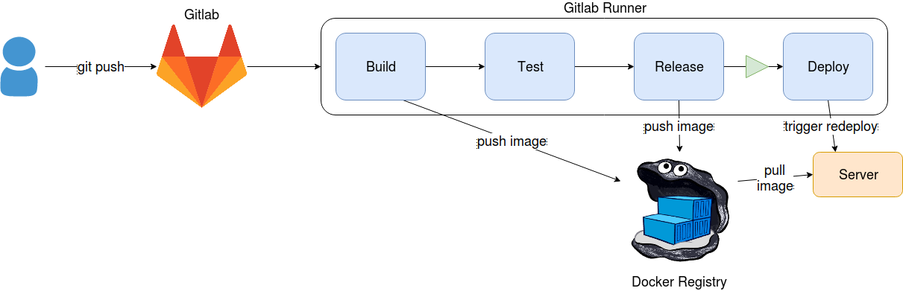

# Déploiement avec un Docker Registry



Cette méthode, plus avancée que la [méthode git+ssh](/fr/#/Automatisation/Gitlab/ssh+git), utilise des images Docker et un Docker registry pour le test et le déploiement. Elle est plus adaptée pour des applications complexes grâce aux avantages qu'elle apporte, comme notamment:

- On utilise pleinement le fonctionnement des images et containers Docker. Ainsi, les sources et les dépendances d'une application voyagent ensemble
- Il est plus facile de tester notre application dans le pipeline car on peut créer rapidement un environnement de test
- Il est facile de debugguer un éventuel problème car on a la possibilité de récupérer sur une machine locale les images placées dans le Docker registry.

> Du point de vue développeur, cela reste toujours aussi simple avec un git push qui déclenche le pipeline automatisé.

## Pré-requis

- Un serveur GitLab ainsi qu'un runner configuré en mode *Docker*
- Un serveur Docker Registry (hébergé ou non sur Hidora). Vous pouvez utiliser ce script pour en déployer un en deux cliques sur la plateforme: https://github.com/HidoraSwiss/manifest-registry

## Dockerfile

Dans un premier temps, il est nécessaire d'ajouter à vos sources un fichier `Dockerfile` qui va construire une image prête pour la Production à chaque push.

Les fichiers présents dans l'image Docker qui sera utilisée pour le déploiement doivent se suffire à eux-même. Il est donc nécessaire d'ajouter les fichiers sources de votre dépôt directement dans l'image par l'intermédiaire du Dockerfile.

Par exemple, si vous souhaitez déployer une application PHP, votre Dockerfile pourrait ressembler à cela:

```dockerfile
FROM php:7.0-apache
COPY . /var/www/html/
```

Notez l'utilisation de `COPY` qui copie tous les fichiers sources dans le dossier `/var/www/html` servie par Apache. Pour des applications plus complexes (compilation d'assets, téléchargement de configurations...), vous pouvez détailler les actions à réaliser dans le Dockerfile. Pour plus d'infos, [consultez la documentation de Dockerfile](https://docs.docker.com/engine/reference/builder/).

## Création de l'environnement

Avant de pouvoir déployer automatiquement vos modifications, vous devez créer un environnement sur Hidora.

Pour cela, commencer par construire une image avec vos sources localement afin de la pusher sur votre Docker registry:

```bash
docker build -t <url-registry>:<port-registry>/dir/image_name .
docker push <url-registry>:<port-registry>/dir/image_name
```

Ainsi, vous aurez une première image permettant de créer un nouvel environnement sur Hidora.

Ensuite, connectez-vous sur l'interface web et utilisez le panneau *New environment* pour créer un environnement utilisant l'image dans votre Docker registry.


## .gitlab-ci.yml

Dans un fichier `.gitlab-ci.yml` placé dans vos sources, copiez le contenu suivant:

```yaml
image: docker

variables:
  IMAGE_TEST: dir/image_name:$CI_COMMIT_REF_NAME
  IMAGE_RELEASE: dir/image_name:latest

stages:
  - build
  - test
  - release
  - deploy
  
before_script:
  - docker login -u $REGISTRY_USER -p$REGISTRY_PASS $REGISTRY_URL
  
build:
  stage: build
  script:
    - docker build -t $REGISTRY_URL/$IMAGE_TEST .
    - docker push $REGISTRY_URL/$IMAGE_TEST

test:
  stage: test
  script:
  	- echo "Test your application using the new image"
  	# # Example:
    # - docker pull $REGISTRY_URL/$IMAGE_TEST
    # - docker $REGISTRY_URL/$IMAGE_TEST ./test-script.sh

release:
  stage: release
  only:
    - master
  script:
    - docker pull $REGISTRY_URL/$IMAGE_TEST
    - docker tag $REGISTRY_URL/$IMAGE_TEST $REGISTRY_URL/$IMAGE_RELEASE
    - docker push $REGISTRY_URL/$IMAGE_RELEASE
    
deploy:
  stage: deploy
  image: mwienk/jelastic-cli
  when: manual
  only:
    - master
  before_script:
    - /root/jelastic/users/authentication/signin --login $LOGIN --password $PASSWORD --platformUrl app.hidora.com
  script:
    - /root/jelastic/environment/control/redeploycontainerbyid --envName $ENVNAME --nodeId $NODE_ID --tag latest --useExistingVolumes false
```

Cette configuration décrit un pipeline générique qu'il faut adapter à votre application. Pensez notamment à modifier:

- Le nom de votre image dans les variables en remplaçant `dir/image_name` comme vous souhaitez
- Les commandes à lancer pour tester votre application dans la partie `test`

Ensuite, il faut fournir à votre pipeline des variables d'environnement pour qu'il puisse déployer correctement votre application. Depuis la page de votre dépôt sur Gitlab, rendez-vous dans *Settings > CI/CD > Secret variables* puis ajouter les variables suivantes:

- **REGISTRY_URL**: L'adresse de votre Docker registry. Par exemple, `registry.hidora.com:5000`
- **REGISTRY_USER** et **REGISTRY_PASS**: Les identifiants pour s'authentifier sur votre Docker registry


- **ENVNAME**: Le nom de l'environnement sur Hidora dans lequel vous souhaitez déployer votre application. Par exemple, `env-542623` (ne pas mettre la partie *.hidora.com*)
- **NODE_ID**: L'ID du noeud sur lequel vous souhaitez déployer votre application
- **LOGIN** et **PASSWORD**: Les identifiants vous permettant de vous authentifier sur la plateforme Hidora

## C'est parti !

Une fois toutes les étapes réalisées, pushez vos sources sur Gitlab avec les deux fichiers nouvellement créé. et rendez-vous sur la page *CI/CD > Pipelines* de votre dépôt pour visualiser les logs.


Si tout se passe bien, vous devrez voir que chaque "job" du pipeline affiche une icône vert. Selon la configuration de notre pipeline Gitlab, le dernier job est en mode "manuel", c'est-à-dire que vous devez le déclencher manuellement pour lancer le déploiement. Pour terminer le pipeline, cliquez donc sur le symbole "play" au bout de la ligne correspondant au dernier pipeline.

Dans le cas inverse, cliquez sur le job qui n'a pas abouti pour en voir la raison.

## Persistance des données

En fonction de l'application, il peut y avoir quelques configurations à faire pour éviter de perdre des données.

Dans la méthode de déploiement présentée ci-dessus, si des fichiers sont rajoutés sur le serveur de déploiement, ils seront perdus lors d'un redéploiement. Cela s'explique par l'utilisation de l'option `--useExistingVolumes false` (dernière ligne du pipeline) qui précise que l'on veut remplacer l'ensemble des fichiers du container par ceux de la nouvelle image lors du redéploiement.

Pour avoir une persistance de certaines données, comme par exemple des fichiers uploadés ou des fichiers de logs, il est nécessaire de configurer comme ceci:

- Dans votre Dockerfile, les dossiers à ne pas écraser entre chaque déploiement doivent être déclarés en tant que volume (exemple: `VOLUME /var/html/www/wp-content/uploads`). Attention ! Si le dossier contenant vos sources est déclaré comme *volume*, les modifications de ces fichiers ne seront pas prises en compte au redéploiement.

> Attention également aux Dockerfiles dont vous héritez qui peuvent aussi déclarer des volumes. Si c'est le cas, il faut retirer les volumes dans la configuration de votre container quand vous créez un environnement sur Hidora.

- Dans le fichier `.gitlab-ci.yml`, remplacez `--useExistingVolumes false` par `--useExistingVolumes true`

En faisant ainsi, les fichiers propres au serveur de déploiement seront gardés tandis que les fichiers sources de votre application seront mis à jour.


Cette configuration peut être relativement difficile à mettre en place. N'hésitez pas à contacter le [support de Hidora](https://support.hidora.com/portal/newticket) pour toute question.

Vous avez trouvé des erreurs ou des optimisations possibles ? Dites le nous sur [GitHub](https://github.com/HidoraSwiss/documentation) !