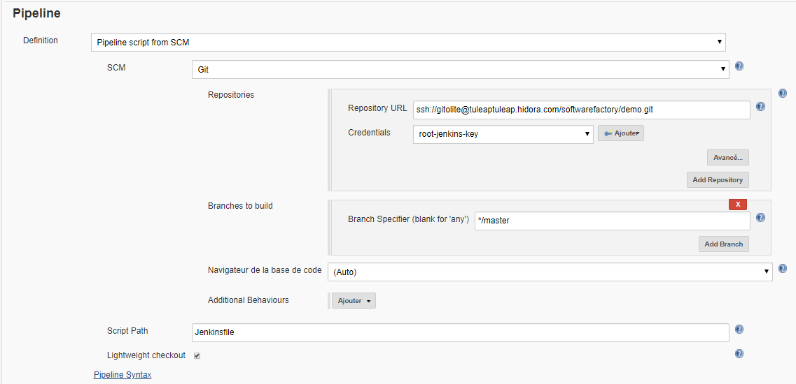

# Déployer automatiquement une image avec Tuleap et Jenkins


La méthode que nous allons mettre en place fonctionne sur le même principe que [Docker Registry avec Gitlab](../Gitlab/DockerRegistry.md). C'est-à-dire que nous allons essayer d'automatiser le déploiement d'une application sur la plate-forme Hidora. 

## C'est quoi Jenkins ?
[Jenkins](https://jenkins.io/) est un outil open source d'intégration continue. Il a été développé en java et permet donc d'automatiser des tâches nonhuman. Jenkins supporte les outils de contrôle de versions tel que Subversion, Git, CVS ...
Il est possible de lancer des *builds* automatisés de différentes façons comme pour un *commit* sur un contrôle de versions, en le planifiant avec un *cron*, où même lancer après le *build* d'un autre projet.
Ces *builds* vont pouvoir détecter  des anomalies en amont au cours du développement. 

## C'est quoi Tuleap ?
[Tuleap](https://www.tuleap.org/) est un outil complet, permettant de faire du suivi de tickets, gérer des projets agiles, automatiser les développements etc ...  De grandes compagnies t'elle qu'Orange, Atos, Renault, Ericsson ont opté pour cette solution permettant de regrouper le fonctionnement de leurs entreprises dans un seul et même outil.
Dans notre cas, nous allons utiliser la gestion de contrôle de version Git de Tuleap, mais aussi du plugin Jenkins ( qui nous permettra de lancer un *build* de Jenkins après chaque *commit*).

## Comment ça va fonctionné ?
Nous allons mettre en place l'architecture présenté en photo ci-dessus.
 - Un développeur va faire un `git push` sur le Git de Tuleap
 - Cela va automatiquement lancer un Build sur Jenkins
 - Ce Build va :
	 - construire une image avec les informations présente dans le Git de Tuleap
	 - tester le bon fonctionnement de l'image
	 - pusher notre image dans un Docker registry
	 - déployer l'image construite sur notre plateforme Hidora

## Les pré-requis

 - Dans votre projet que vous allez pusher, vous devez avoir un `Dockerfile`qui permettra de construire votre image Docker.
 - Le script de déploiement `deploy-to-jelastic.sh `dans l'onglet [Script de déploiement](http://documentation.hidora.com/fr/#/Automatisation/Script%20de%20d%C3%A9ploiement) pour déployer l'image sur Hidora.
 -  Un fichier `manifest` (manifeste.jps) qui permettra de l'image sur Hidora. Le script  `deploy-to-jelastic.sh`en a besoin pour fonctionner. 
 - Un fichier `Jenkinsfile`, qui effectuera la construction de l'image, les tests, le push vers le Docker registry et aussi le déploiement. C'est ce fichier qui va automatiser le déploiement d'environnement. 
 - Un environnement Tuleap, Jenkins et un Docker Registry sur Hidora (ce n'est pas obligatoire d'avoir les trois instances sur Hidora).
 
## Contenu des fichiers


### Dockerfile
Voir la partie [Docker registry - Dockerfile ](http://documentation.hidora.com/fr/#/Automatisation/Gitlab/Docker%20registry), pour avoir plus d'information.

### Deploy-to-jelastic
Voir la partie [Script de déploiement](http://documentation.hidora.com/fr/#/Automatisation/Script%20de%20d%C3%A9ploiement), pour avoir plus d'information.

### Jenkinsfile

``` bash
node {
    def app

    stage('Clone repository') {
        /* On verifie que nous avons bien cloner les fichiers présents dans le Git de Tuleap*/
        checkout scm
    }
    stage('Build image') {
        /* On construit l image Docker "demo/myimage" */
        app = docker.build("demo/myimage")
    }
    stage('Test image') {
         /* On va tester que notre image fonctionne bien, et a bien été créée */
        app.inside {
            sh 'echo "Hello !!!"'
        }
    }
    stage('Push image') {
	    /* On push l image créee dans le docker registry environnement-registry.hidora.com, avec les identifiants enregistrés dans Jenkins */
        docker.withRegistry('http://environnement-registry.hidora.com', 'cred_registry') {
            app.push("latest")
        }
    }
	stage('Deploy') {
	/* On va deployer notre image sur Hidora à l aide du script deploy-to-jelastic.sh. $LOGIN et $PASSWORD sont les identifiants pour se connecter à la plateforme Hidora. Demo-Image sera le nom de notre environnement. On précise qu'on va utiliser la manifeste manifest.jps pour deployer l'environnement*/
      withCredentials([usernamePassword(credentialsId: 'cred_jelastic_id', usernameVariable: 'LOGIN', passwordVariable: 'PASSWORD')]) {
          sh 'chmod +x deploy-to-jelastic.sh'
          sh './deploy-to-jelastic.sh $LOGIN $PASSWORD Demo-Image  manifest.jps cp '
      }
    }
}
```
C'est ce Jenkinsfile qui va donc s'occuper d’orchestrer les phases de construction de l'image docker, de test, de push et de déploiement.

### Manifest.jps

```json
type: install
version: 1.4
name: Demo image
displayName: Image deployée avec Jenkins & Tuleap
description: Image deployée avec Jenkins & Tuleap
ssl: true

nodes:
  - image: demo/myimage:latest
    registry:
      url:                 environnement-registry.hidora.com
      user:                tech@hidora.com
      password:            fgr8F49f4FR
    count: 1
    fixedCloudlets: 4
    cloudlets: 32
    nodeGroup: cp
    volumes:
      - /var/www/html

success: |
  # Installation terminée !
  The page is ready to view  !!!!
```
Ici nous avons un manifeste qui va permettre de déployer la dernière version de l'image `demo/myimage`, provenant du Docker Registry `environnement-registry.hidora.com` et ayant comme identifiant `tech@hiora.com` associé au mot de passe `fgr8F49f4FR`. 
Il nous est aussi possible d'assigner le nombre de Cloudlets dynamique  et réservé. 


## 1. Copiez votre clé publique dans Tuleap
Il vous faut copier votre clé publique (de votre serveur de développement) dans Tuleap afin de pouvoir être capable de faire  des push directement dans le Git Tuleap.
 MyAccount --> Key --> Add Keys.
Ensuite créez un répertoire Git (ex: demo) dans Tuleap. Dans ce répertoire vous allez trouver l'adresse SSH à utiliser pour faire un push sur ce Git Tuleap.


## 2. Ajoutez le répertoire distant Git
Sur votre serveur de développement, ajoutez le répertoire distant `demo`, que vous venez de créer sur Tuleap.
Pour cela, vous allez avoir besoin de l'adresse SSH que Tuleap a fournie pour le répertoire `demo`.

**Exemple de commande et d'adresse SSH:**
```` bash
git remote add demo ssh://gitolite@tuleap.hidora.com/softwarefactory/demo.git
```` 
`tuleap.hidora.com` est par exemple l'URL de votre instance Tuleap.
`softwarefactory` c'est le nom de votre projet Tuleap où vous avez crée le Git `demo`.
`demo.git`c'est le nom de votre répertoire Git

> Vérifiez que vous avez les fichiers prérequis  dans votre projet que vous allez pusher sur Git

## 3. Création d'un Pipeline dans Jenkins
Sur Jenkins, vous devez créer un Pipeline qui se lancera automatiquement après un *push* vers le Git Tuleap. On va donc créer un Pipeline qui se nommera `Pipeline-demo`.

*Nouveau item*--> *Saisissez un nom* (ex : Pipeline-demo) et choisissez *Pipeline* comme type de projet.

Une fois créée, allez directement à la section Pipeline de `Pipeline-demo`. On va choisir *Pipeline script from SCM*  comme définition et Git comme *SCM*.
Dans la partie *Repository URL* copiez l'URL de votre Git  `ssh://gitolite@tuleap.hidora.com/softwarefactory/demo.git`.  Pour permettre à Jenkins de Tuleap de communiquer, il faut ajouter la clé publique de Jenkins dans Tuleap (comme l'etape 1 avec le serveur de développement). Et ajoutez  * Credentials* des identifiants *SSH Usrname with private key* .
La *clé privée* que vous venez de rentrer dans ce nouveau *credentials* doit correspondre à la deuxième clé publique placée dans Tuleap.
Toujours dans la section *Pipeline* de `Pipeline-demo`, précisez le nom du votre fichier Jenkins que vous voulez exécuter, `Jenkinsfile`.



## 4.  Création d'un Job sur Tuleap
Tuleap est un outil complet qui permet d'ajouter de nombreux plugins, comme par exemple Hudson/Jenkins.
Dans la partie * Continuous Intégration* de notre projet, on va créer un Job qui lancera le`Pipeline-demo`
 de Jenkins.
 Pour cela, il faut ajouter l'URL du `Pipeline-demo` Jenkins et choisir `demo`dans la partie *Trigger a build after commits*. 
 
**Exemple de Job URL :**
` http://jenkins.hidora.com/job/Pipeline-demo`

`jenkins.hidora.com` étant l'URL de votre Jenkins,
`Pipeline-demo` le nom de votre Pipeline


----------
Notre architecture est maintenant en place, essayez de lancer un Git push dans le répertoire `demo` de Tuleap.
Vous verrez ensuite qu'un nouvel environnement a été créée sur la plateforme Hidora.

Cette configuration peut être relativement difficile à mettre en place. N'hésitez pas à contacter le  [support de Hidora](https://support.hidora.com/portal/newticket)  pour toute question.

Vous avez trouvé des erreurs ou des optimisations possibles ? Dites le nous sur  [GitHub](https://github.com/HidoraSwiss/documentation)  !
