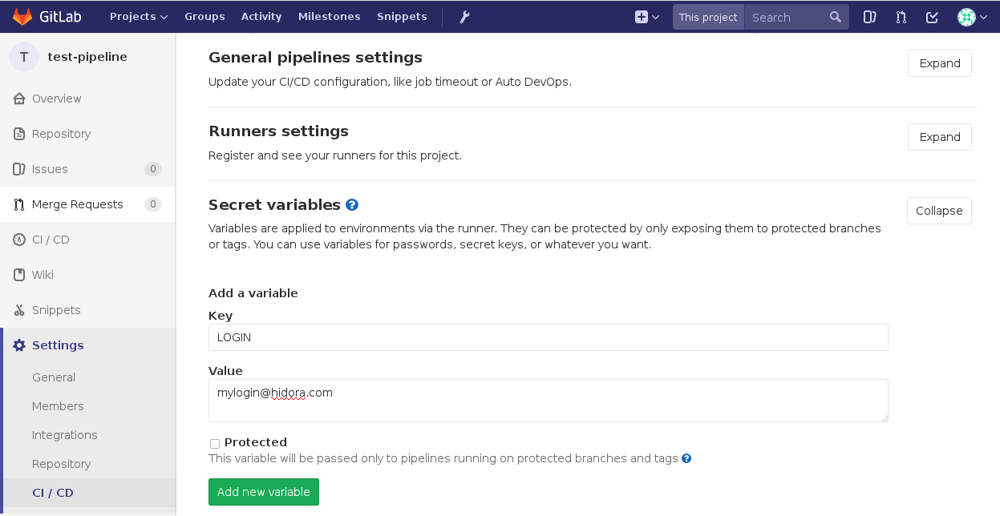

# Déploiement depuis Gitlab

Cette documentation se veut simple et rapide à mettre en place. N'hésitez pas à contacter le support de Hidora si vous rencontrez des problèmes ou que vous souhaitez mettre en place une configuration plus complexe.

## Déploiement dans un environnement Docker custom

### 1. Cloner le projet git dans votre environnement

Dans un premier temps, il faut initialiser un dépôt git sur votre serveur hébergé sur Hidora.

Par exemple, si vous utilisez un noeud [php:apache](https://store.docker.com/images/php), clonez votre dépôt git dans `/var/www/html/`.

> Assurez d'avoir *git* installé sur ce noeud. 
> Il est conseillé de placer les données dans un second noeud de type *storage* (qui a git installé par défaut) et de mapper les dossiers utiles dans les noeuds applicatifs (exple: nginx, apache).

### 2. Ajouter un fichier .gitlab-ci.yml au projet

Pour que Gitlab exécute le pipeline automatisé, il est nécessaire de lui fournir une configuration, directement dans les fichiers du projet. Pour ce faire, ajouter un fichier nommé `.gitlab-ci.yml` à votre dépôt avec le contenu suivant :

```yaml
image: mwienk/jelastic-cli

variables:
  APP_DIR: "/var/www/html" # À adapter en fonction de l'environnement

before_script:
    - /root/jelastic/users/authentication/signin --login $LOGIN --password $PASSWORD --platformUrl app.hidora.com

deploy:
  only:
    - master
  script:
    - "/root/jelastic/environment/control/execcmdbyid --envName $ENV_NAME_DEV --nodeId $NODE_ID_DEV --commandList \"[{'command': 'cd $APP_DIR && git pull'}]\" > /tmp/output"
    - "cat /tmp/output && cat /tmp/output | grep exitStatus | cut -c23"
    
```

### 3. Configurer les accès à l'API dans Gitlab

Le fichier de configuration du pipeline automatisé utilise des variables `$LOGIN`, `$PASSWORD`, `$ENV_NAME_DEV` et `NODE_ID_DEV` permettant d'utiliser l'API de Hidora. Pour que le pipeline les utilises, ajoutez ces valeurs aux *secret variables* dans votre projet sur Gitlab.

Pour ce faire, depuis la page de votre projet:

1. Rendez vous dans Settings > CI / CD
2. Ouvrez la partie *Secret variables*
3. Ajouter les variables suivantes :
   - `LOGIN` et `PASSWORD` : vos identifiants Hidora
   - `ENV_NAME_DEV` : Le nom de l'environnement de déploiement, sans le *hidora.com* (exple: *documentation*)
   - `NODE_ID_DEV` : l'ID du noeud sur lequel vous souhaitez déployer (exple: *15035*). Vous pouvez le voir dans l'interface web de Hidora.



### 4. Tester le pipeline

Pour tester votre pipeline, pusher une modification dans votre projet sur Gitlab.

À chaque push sur la branche *master* de votre projet, Gitlab va lancer un pipeline de déploiement. Vous pouvez en visualiser les journaux sur la page CI /CD > Pipelines et en cliquant sur un des stages.

### Problèmes connus

#### Le pipeline passe mais le code n'est pas déployé à la fin d'un pipeline

Le problème le plus probable est la présence de conflits git lors du pull sur le serveur distant. Pour le moment, l'API de Jelastic permettant de lancer des commandes à distance sur un noeud Hidora est plutôt limitée et elle ne fait pas rater le pipeline si git rencontre des conflits lors du pull.

Le problème a été relevé et Jelastic travaille sur une résolution: https://stackoverflow.com/questions/47111461/make-gitlab-pipeline-failed-using-jelastic-api

Si cela arrive, il faut faire un pull "manuel" en se connectant sur le serveur et résoudre les conflits de git. Pour une solution optimale, il ne faudrait pas que des fichiers générés en production (logs, assets) soient suivi par git en configurant convenablement un fichier `.gitignore`.

#### Le pipeline rate avec un problème de "session"

À chaque utilisation du pipeline, on crée un *session token* pour utiliser l'API Jelastic. Si trop de requêtes sont envoyées à l'API en même temps (en terme de minute), il semble que la plateforme n'a pas le temps d'ouvrir et de fermer les sessions au fur et à mesure donc elle refuse le *token session* que l'on vient de créer.
Pour le moment, il n'y a pas de meilleure solution que de réduire la fréquence des push ou de créer une branche "deploy" qui lancera le pipeline moins souvent.